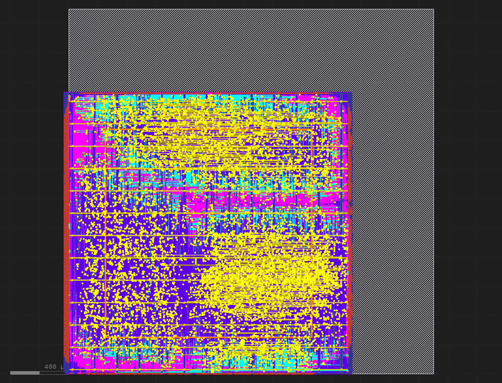

# Systolic-Matrix-Multiplier
Built off the 8x8 matrix multiplier made in EEC 180 (check the EEC 180 repo for lab 6).

Yeah after looking at the matrix multiplier made in EEC 180, hell no I'm not using it. We made it do the actual matrix multiplication in the testbench by instantiating a bunch of multiply accumulate units. How in the world did this thing work. I'm gonna start over lmao.

# Results

## Matrix Multiplication

## Systolic Matrix Multiplication

As we can see, the normal matrix multiplication for an 8x8 matrix takes well over 5,000,000ns, whereas the systolic version takes just over 200ns. The systolic matrix multiplication is around ~x25,000 faster than the normal matrix multiplier. This is due to the inherent nature of systolic matrix multiplication. Normal matrix multiplication is done in a "nested loops" way, with lots of memory accesses and waiting for things to finish. This is incredibly slow, and is reflected in the overall computation time (5,000,000ns is 0.005s). Systolic multiplication uses a grid of processing elements that pass the resultant data along to the next processing element, bypassing the need for memory accesses and thus drastically improving calculation time.

# Layout

In hindsight, running layout on a massively parallel system with a bunch of multiply accumulate units on a laptop was not the brightest idea I've had. Oops!

## Placement Density

## Power Density

Yeah idk why the power density is not working. Uploaded the VCD file successfully and it's still not giving me anything. I'll troubleshoot later:tm:.

## Routing Congestion

## Estimated Routing Congestion (RUDY)

## IR Drop

IR drop has not been populated with data, and idk how to fix it. I'll fix it later:tm:.

